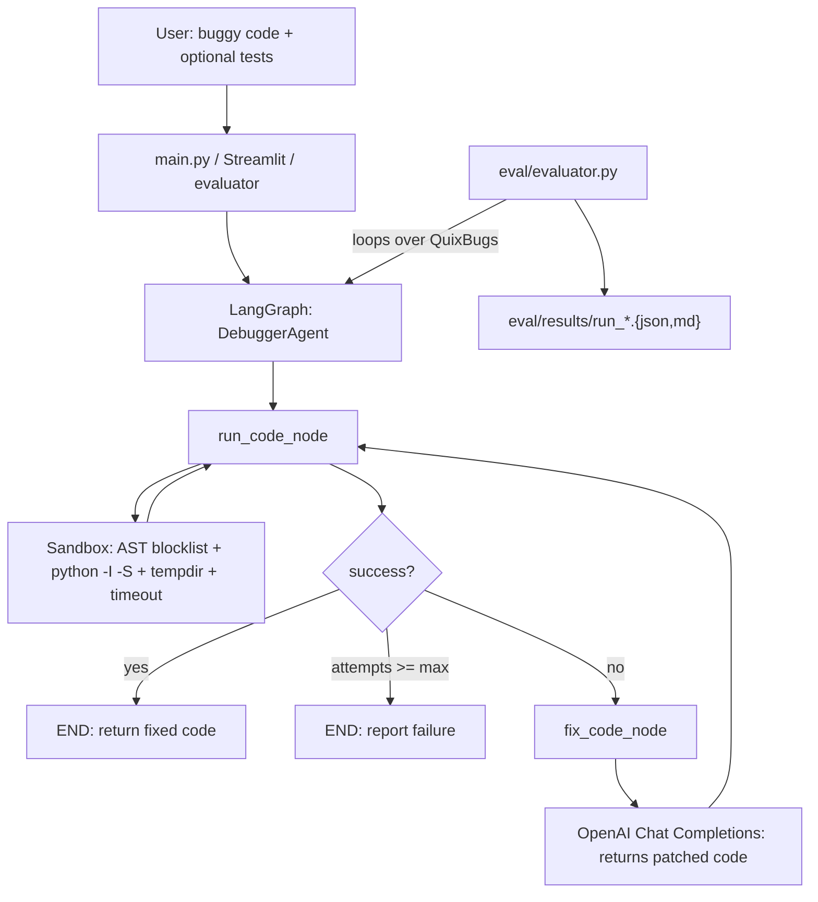

# Autonomous Code Debugging Agent

A LangGraph-driven Python debugging agent that **executes code in a hardened
subprocess sandbox**, captures real runtime errors, and iteratively repairs the
program with OpenAI until it passes a test harness or a retry budget is hit.

It is **not** a "send code, get fix" wrapper:

- It runs an actual Python interpreter on each attempt and reads real stderr.
- It rejects unsafe imports (`subprocess`, `socket`, `ctypes`, ...) before they
  reach the interpreter via an AST scan, and isolates filesystem access in a
  per-run temp directory.
- It is benchmarked end-to-end against the
  [QuixBugs](https://github.com/jkoppel/QuixBugs) dataset, scoring each fix by
  whether it passes every JSON test case for that program (not just "doesn't
  crash").

## Architecture



State flows through a single `TypedDict` (`agent/state.py`):

| Field            | Description                                                  |
| ---------------- | ------------------------------------------------------------ |
| `code`           | The current candidate source.                                |
| `original_code`  | The user's buggy program (preserved for reporting).          |
| `tests`          | Optional harness appended to `code` before each run.         |
| `error`          | Captured stderr from the most recent run.                    |
| `exception_type` | Parsed from the traceback (e.g. `IndexError`).               |
| `attempts`       | LLM repair iterations consumed so far.                       |
| `max_attempts`   | Retry budget (default 3).                                    |
| `history`        | Per-attempt audit trail (code, error, LLM output, duration). |
| `success`        | Did the most recent run pass?                                |

## Why this is not a wrapper

| Concern        | What this project does                                                                                                              |
| -------------- | ----------------------------------------------------------------------------------------------------------------------------------- |
| Real execution | `subprocess.run([python, "-I", "-S", script], cwd=sandbox_dir, timeout=...)` per attempt.                                           |
| Sandbox        | AST scan rejects 25+ blocked modules (`subprocess`, `socket`, `ctypes`, ...) and `os.system`/`exec`/`eval` before the child starts. |
| Control flow   | Explicit LangGraph `StateGraph` with `run` / `fix` / conditional router nodes -- not a hidden ReAct loop.                           |
| Validation     | QuixBugs benchmark: each repaired program must pass every JSON test case to count as a pass.                                        |
| Observability  | Per-attempt `history` records the code under test, captured stderr, and the LLM's proposed diff.                                    |

## Repository layout

```
.
+-- agent/
|   +-- executor.py          # Hardened subprocess sandbox + AST blocklist
|   +-- llm.py               # OpenAI client + fix_code()
|   +-- prompts.py           # System + user prompt templates
|   +-- state.py             # DebugState TypedDict
|   +-- debugger.py          # debug_loop() + LangGraph DebuggerAgent + run_debug_session()
+-- eval/
|   +-- quixbugs_loader.py   # Loads buggy programs + JSON testcases
|   +-- evaluator.py         # Runs the agent over QuixBugs, writes pass_rate.md
|   +-- results/             # Per-run JSON + markdown summary
+-- ui/
|   +-- streamlit_app.py     # Live demo: paste code, watch the attempt timeline
+-- tests/
|   +-- test_executor.py     # Sandbox unit tests (no API)
|   +-- test_debugger_loop.py# End-to-end loop tests with the LLM mocked
+-- data/QuixBugs/           # git submodule: jkoppel/QuixBugs
+-- main.py                  # CLI: `python main.py path/to/buggy.py`
+-- requirements.txt
+-- .env.example
+-- README.md
```

## Setup

```bash
git clone <this repo>
cd "Autonomous Code Debugging Agent"
git submodule update --init                # pulls QuixBugs into data/QuixBugs

python -m venv .venv
.venv\Scripts\activate                      # Windows; use `source .venv/bin/activate` on Unix
pip install -r requirements.txt

cp .env.example .env
# edit .env and paste your OPENAI_API_KEY
```

## Usage

### CLI

```bash
python main.py path/to/buggy.py
python main.py path/to/buggy.py --max-attempts 5 --model gpt-5-mini
echo "print(1/0)" | python main.py -
```

The CLI prints the repaired source to stdout and a one-line summary to stderr.

### Streamlit demo

```bash
streamlit run ui/streamlit_app.py
```

You get a code editor, sample bugs, a per-attempt timeline showing the captured
stderr and the LLM's proposed diff, plus the final repaired source.

### QuixBugs benchmark

```bash
python -m eval.evaluator --model gpt-5-mini --max-attempts 3
python -m eval.evaluator --model gpt-5-mini --limit 5     # quick smoke run
python -m eval.evaluator --only gcd bucketsort possible_change
```

Outputs `eval/results/run_<timestamp>.json` (per-program detail) and
`run_<timestamp>.md` (headline pass-rate + per-program table).

A run looks like:

```
Evaluating 31 QuixBugs problems...
[1/31] bitcount... PASS in 1 attempt(s)
[2/31] bucketsort... PASS in 1 attempt(s)
...
[31/31] wrap... PASS in 2 attempt(s)

Pass rate: 27/29 (93.1%)
Wrote eval/results/run_20260428_001000.json
Wrote eval/results/run_20260428_001000.md
```

> Pass-rates depend on the model and retry budget. Numbers above are
> illustrative -- paste your own here after running the eval.

### Eval coverage

QuixBugs ships 40 buggy Python programs. Of those:

- **31 are JSON-driven** (each program has a `.json` file of `[input, expected]`
  cases) and are evaluated end-to-end.
- **9 are graph/linked-list problems** (BFS, DFS, detect_cycle, MST, reverse
  linked list, shortest paths, topological ordering) whose tests require
  hand-built `Node` fixtures. They are excluded from the headline metric and
  listed in `eval/quixbugs_loader.py::UNTESTED_PROGRAMS`.
- **2 of the 31** (`knapsack`, `levenshtein`) reference solutions are inherently
  slow on QuixBugs' largest test cases. The evaluator detects this via a
  pre-flight sanity check and labels them `harness_fails_on_reference`, so they
  are reported as skipped rather than counted against the agent.

## Sandbox

`agent/executor.py` runs every candidate program via:

```python
subprocess.run(
    [sys.executable, "-I", "-S", "candidate.py"],
    cwd=tempfile.mkdtemp(prefix="debugger_sbx_"),
    env={"PATH": ..., "SYSTEMROOT": ..., "PYTHONIOENCODING": "utf-8", ...},
    timeout=10.0,
    capture_output=True,
)
```

Before that, an `ast.NodeVisitor` rejects programs that:

- Import any module under
  `subprocess`, `shutil`, `socket`, `ssl`, `requests`, `urllib*`, `http*`,
  `ftplib`, `smtplib`, `telnetlib`, `ctypes`, `multiprocessing`, `threading`,
  `asyncio`, `pty`, `pwd`, `grp`, `resource`, `signal`, `winreg`, `msvcrt`.
- Call `os.system`, `os.popen`, `os.exec*`, `os.spawn*`, `os.fork`, `os.remove`,
  `os.unlink`, `os.chmod`, `os.chown`, ...
- Use `__import__('<blocked>')` or `eval()` / `exec()` to dynamically reach a
  blocked module.

This is best-effort sandboxing for an LLM coding loop. **It is NOT
adversarial-grade isolation** -- a determined attacker who can see the source
can still craft AST-friendly payloads that load arbitrary stdlib at runtime.
For untrusted user input in production, wrap the executor in Docker
(`--network=none --read-only`) or gVisor instead.

## Tests

```bash
python -m pytest tests/ -v
```

Covers the sandbox blocklist (13 cases) and the LangGraph loop end-to-end with
the LLM mocked (6 cases). No API key required to run the test suite.

## Limitations

- Single-file programs only -- multi-file projects, package imports beyond
  stdlib, and `pip install` are not supported by the sandbox.
- `temperature=0.0` and a fixed prompt; this project does not explore prompt
  variants or self-consistency voting.
- The QuixBugs harness compares on equality (with `math.isclose(rel_tol=1e-3)`
  for floats and tuple/generator coercion). It will not catch fixes that
  preserve correctness through a different return type.
- Only Python is supported. The agent stack (executor + prompts) is
  language-agnostic in shape but the runner currently shells out to
  `sys.executable` only.
